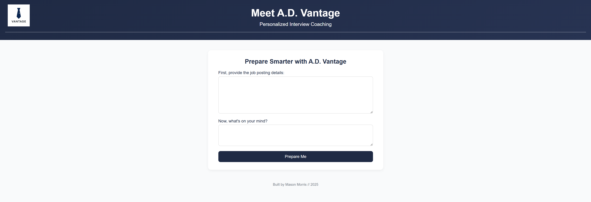
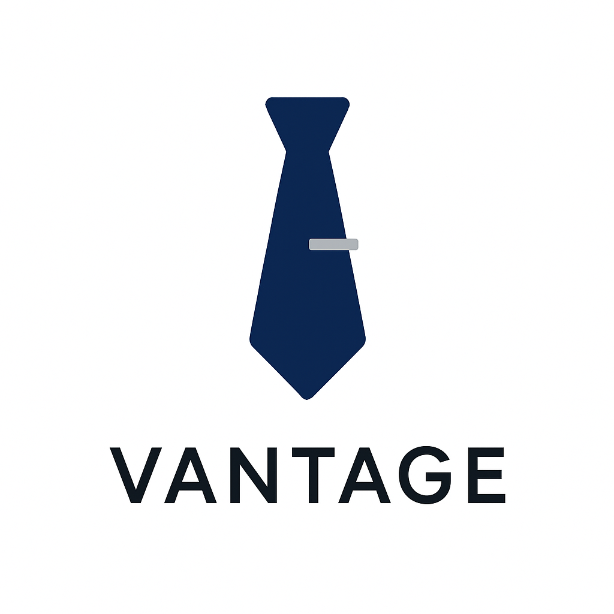

# Vantage – AI-powered Interview Prep Assistant

Vantage is an OpenAI-powered interview simulation tool that helps users prepare for job interviews through personalized, real-time coaching. Built with Flask and Docker, and deployed via Fly.io, it features a sleek, branded frontend and carefully engineered prompt logic.

## Features

- GPT-powered interview coaching using OpenAI's `gpt-3.5-turbo`
- Clean, branded UI with fade animations, auto-scroll, and responsive layout
- Secure `.env` configuration for API keys and deployment credentials
- Dockerized for consistent builds and containerized deployment
- Live deployment available via Fly.io

## Tech Stack

- Python + Flask
- OpenAI API (ChatCompletion)
- HTML, CSS, Jinja2 Templates
- Docker
- Fly.io (hosting and CI/CD)

## Live Demo

Access the live site here:  
**https://vantage-app.fly.dev**

## Screenshots

## License

This project is for personal portfolio and educational purposes only. Commercial use, redistribution, or resale is not permitted without explicit permission from the author.

